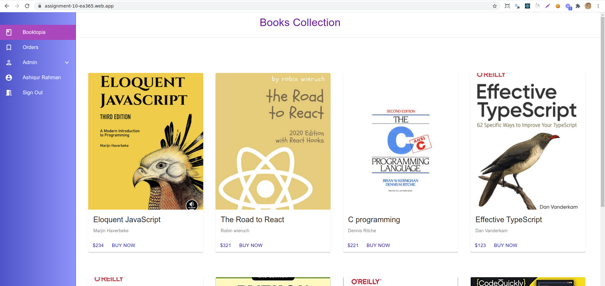

<div align="center">
  

# Booktopia - A Online Book Shop

A platform where you can buy/manage books

<br/>


✨ _Loved the project? Give this project a star to show your support._ ✨


   
</div>

---

## 🧐 Feature list

- [x] explore favourite books
- [x] login with google
- [x] manage books
- [x] order books
- [x] image upload using imagebb api


## 🚀 Getting started

This project is deployed at https://assignment-10-ea365.web.app/

Guide for local deployment -

1. Clone the repository

```bash
https://github.com/Porgramming-Hero-web-course/full-stack-server-ashiqdev
```

2. go to server folder

```bash
cd server
```

3. give credentials in .env file

```bash
cp example.env .env
```

4. Install dependencies

```bash
yarn
```

5. run the server

```bash
yarn dev
```

6. go to client folder

```bash
cd ..
cd client
```

7. give credentials in .env file


```bash
cp example.env .env
```

8. run the server

```bash
yarn start
```

9. Open project at http://localhost:3000

## ❤️ Support

If you happen to love this project, leave a star on the repo. That'll keep me motivated. Let me know your thoughts with a tweet. Mention me [@ashikduit](https://twitter.com/ashikduit).

Thanks!

Contributions are welcomed!

<div align="center">
Developed with ❤️ in Bangladesh
</div>